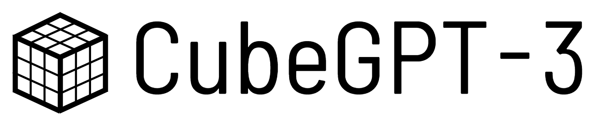
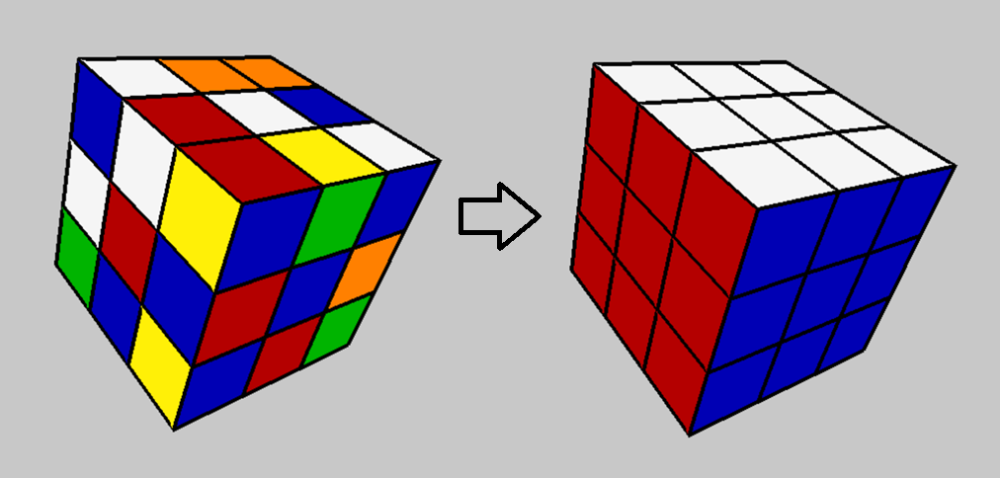
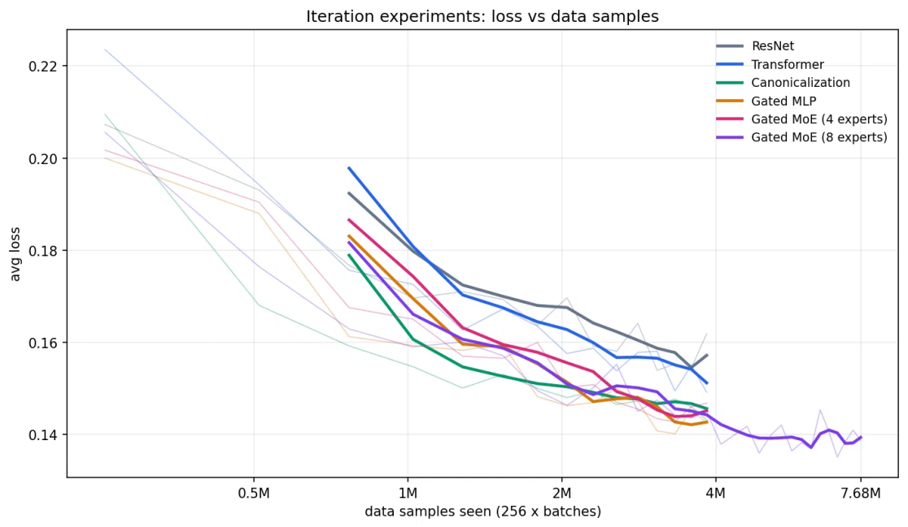
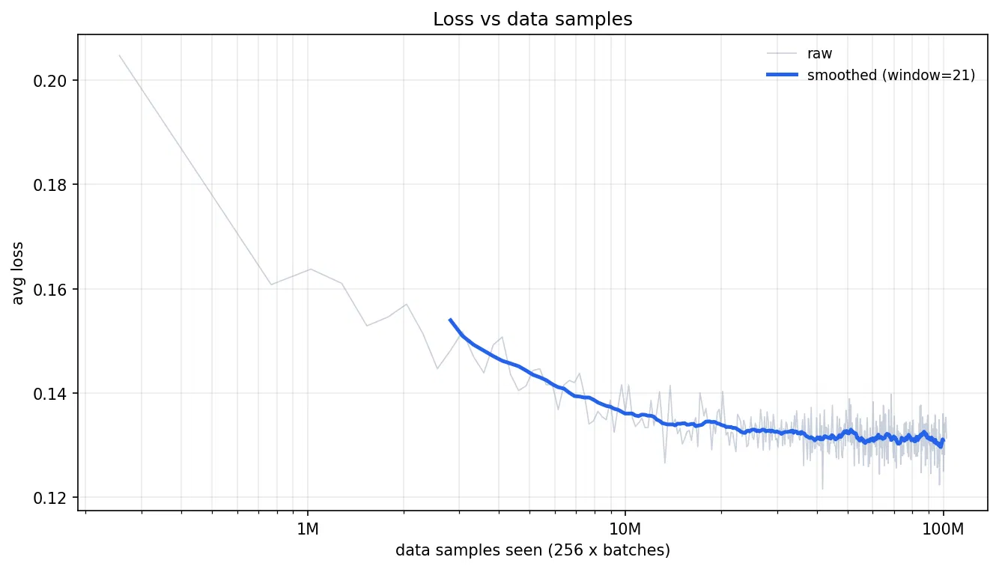

# CubeGPT-3: Scaling up Transformer-based Rubik's Cube Solvers
A research report.

## Introduction

Solving Rubik’s Cubes is hard! There are on the order of 10^19 possible Rubik’s Cube states, and only one winning state. Any standard algorithms like A* search, which explore a significant fraction of possible states, are rendered useless. We have to prune trees extremely aggressively, which is where an estimator trained via machine learning comes in.

All 3D renders in this project made using a 3D renderer I built, by hand.

So does the AI work? Yes! For instance, it finds the following 18-move solution to the cube pictured above:

https://github.com/user-attachments/assets/dd51b826-f864-45e7-99cc-ccca08a05a2e

### Previous Work

This project builds significantly off of the DeepCubeA and CayleyPy papers. It also builds off <a href=https://github.com/stanleytheli/cubegpt>my previous work on training transformers to solve Rubik’s Cubes, CubeGPT-2</a>. Essentially, the strongest model I tested in solving was CubeGPT-2g-PFT, an out-of-the-box transformer architecture running the GeLU activation trained over 25M samples. The strongest model I trained was CubeGPT-CLS-t154m-PFT, which was a classifier model trained on just over 200M samples. 

In this work, CubeGPT-3, I improve the model architecture and training pipeline, and devote more compute to larger-scale experiments, getting significantly closer to optimality. Experiments also reveal more about the nature of training Rubik's Cube models.

## Training

We update the architecture of CubeGPT using some more modern research and Rubik’s Cube symmetries. We also test ResNets to verify that the transformer architecture actually provides benefits.

In order of being added:

* **GPU optimization**: This doesn’t directly improve the models, but speeds up experiments, allowing for faster experiments and hyperparameter tuning. The most significant optimization was moving the data pipeline onto the GPU, which sped up training ~2x and inference ~3x.
* **No Classifier Token**: The old transformer used a special token denoted the ‘cls-token’ to make the final prediction distribution. We now linear over the whole token sequence instead, which empirically works significantly better (possibly allows gradients to flow more thoroughly?)
* **Canonicalization**: Imagine rotating a Rubik’s Cube and then switching back all the colors. This looks different, but really it’s the exact same puzzle. 24 rotations of the cube gives 24 symmetries; we can mirror the cube as well to increase this to 48 symmetries. We enforce this on the model with a cheap preprocessing step. 
* **Gated MLP**: Old MLPs used to do f(x) = B(GeLU(Ax)) for matrices A, B. Gated MLPs do f(x) = C(Ax * SiLU(Bx)). Empirically shown to be better.
* **Mixture of Experts (MoE)**: Deepseek V3-style, using explicitly tuned expert biases for load balancing. Significantly increases information capacity while barely slowing down the forward pass.

The MoE models actually train a bit slower, which is expected given that their gradients can only flow through one expert at a time. However, when we train an 8 expert model for longer, we indeed see it’s capable of reaching low loss. 

Here’s a long training run with an 8 expert model, which I call CubeGPT-3-8A1-t100m.

Using these interventions, we see that CubeGPT-3 is already a step change in capabilities above our old best models, while maintaining similar inference speed due to holding the number of active parameters constant.

|Model|Training Examples (Millions)|Mean Squared Error|Within-3-Accuracy| Within-4-Accuracy|Accuracy (When rounding to nearest int)|
| --- | --- | --- | --- | --- | --- |
|CubeGPT 2g-PFT | 26.2 | 4.70 | 82.49% | 91.37% | 37.88% |
|CubeGPT-CLS-t154mPFT | 204.8 | 4.30 | 83.96% | 92.40% | 42.50% |
|CubeGPT-3-8A1-t100m | 102.4 |  **4.04** | **84.7%** | **92.9%** | **44.8%**
|CubeGPT-3-8A1-t100mPFT | 153.6 |  4.06 | 84.5% | N/A | N/A

Meanwhile, path finetuning seems to hurt the model, increasing MSE to 4.06 and W3A to 84.5%. Small differences, where the confidence intervals begin to mix, but consistently observed across a few different PFT runs. 

Whatever. Look at the metrics on that thing! So, that means it must be way better at solving, right? It turns out, on the third or fourth state I tested it against, it failed to solve (within 30 moves)! Imagine my eyes, my child DNF’ing a Rubik’s Cube after I shoved ~100 million of them down its throat. That’s even worse than CubeGPT-2, which has way worse evals!

## Solving

Feeling defeated, I plugged the PFT’d model into the solver, just to see what would happen. Surprise surprise, CubeGPT-3 with PFT significantly outperforms CubeGPT-2g-PFT. At beam width 4000, while CubeGPT-2 averages 21.1 moves per solve, CubeGPT-3 averages 20.2 — almost a whole move faster! Okay, that number doesn’t look that impressive, but consider that the theoretical optimal average is 17.7. Then we can look at the number of moves above optimal (MAO), which we can think of how many moves it wasted. CubeGPT-2 scores 3.4 MAO, while CubeGPT-3 scores only 2.5, making it about 26% closer to the optimal. 

There are two big takeaways here. Firstly, the evals’ correlation with solving quality is far worse than one could ever expect. Secondly, PFT — which while working on CubeGPT-2 I dismissed as some neat benchmaxxing trick — is not just beneficial but seemingly necessary for solving. 

Now it’s time to start the real experiment. Back in CubeGPT-2 I wasn’t able to run larger beam widths because I was so constrained by compute. But having rented a better GPU and moved the data pipelines onto it, inference is now unreasonably fast. 

|Model| Width | Solve Rate | Average Moves | MAO |
| ---| --- | --- | --- | --- |
|CubeGPT-2| 4000 | 99% | 21.1 | 3.4 |
|CubeGPT-3| 4000 | 99% | 20.2 | 2.5 |
|CubeGPT-3| 16000 | 100% | 19.6 | 1.9 |
|CubeGPT-3| 64000 | 100% | 19.0 | 1.3 |

While doing these experiments, I found a small number of states that couldn't be solved at 4000 width by either model. But this problem seems to disappear when we tune the width higher.

## Future Work

My takeaway from this is that we desperately need better evals. It would also be great to understand what about path finetuning particularly induces solving capability, and to see if we could purposefully boost that. My current interpretation is that training on unrelated samples gives models a global sense of Cube structure, but no local one --- there's no guarantee they'll rank nearby states sensibly. PFT induces that. 

I plan to update this project as I scale and investigate PFT further. I would go so far as to refer to training on non-paths as "pretraining" and PFT as "posttraining," but then I think the LARP would get ridiculous, even for me. There are also other ideas I plan to experiment with, such as recurrence from previous states.

## More Solve Videos

https://github.com/user-attachments/assets/d71554ae-2c3d-4c95-9c00-17c6c1f9edbc

https://github.com/user-attachments/assets/bf7bce2e-1663-4972-af68-6b5380861241
